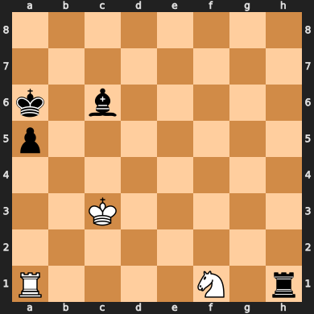
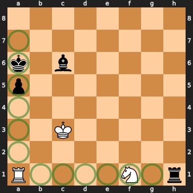
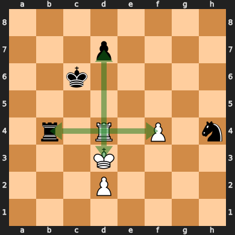
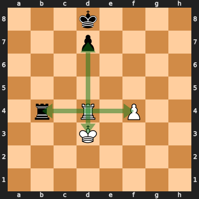

# Efficient sliding move generation in chess: Magic bitboards explained
A common problem in chess programming is how to efficiently generate moves for sliding pieces. Bishops, rooks, and queens move along rays which can be obstructed:


This is a key problem in many chess engines, as sliding moves are significantly more difficult to compute efficiently than most other movements. A naive approach would be to move along each ray, checking each square one by one and stopping at an obstruction. Unfortunately, this is far too slow for modern chess engines, which generate moves for millions of positions every second. There is, however, a much faster alternative: *Magic bitboards*.

## Bitboards
[Bitboard](https://en.wikipedia.org/wiki/Bitboard)-based board representations have become the standard chess board implementation in modern chess engines. A bitboard is a 64-bit bitset where each bit represents a square's presence in the set. Conveniently, modern machines are 64-bit, so there is no wasted space and each operation is only a single instruction. Bitboards are versatile, and have many uses in chess engines. A chess board is usually represented using a bitboard for each piece type and a bitboard for each piece color. For example, the bitboard of all the pawns on this board would look like this:


```
. . . . . . . .
X X X X . X X X
. . . . . . . .
. . . . . . . .
. . . . X . . .
. . X . . . . .
X X . . . X X X
. . . . . . . .
```
There are a few advantages to storing pieces in a bitboard over the fairly obvious approach of an 8x8 array.
For one, bitboards provide efficient set operations through bit operators:
```rust
let white_pieces = board.colors(Color::White);
let pawns = board.pieces(Piece::Pawn);
let white_pawns = white_pieces & pawns;
```
This can make querying and modifying the board state significantly easier.
Another important trick is that as the board is now made of nice and compact numbers, you can do math on it.


## Doing math on it
Consider the A1 rook on this board:



Here, the A5 pawn and the F1 knight are what are known as *blockers*, as they prevent the rook from moving to squares behind them. However, they differ slightly in that the rook may still move to the A5 square by capturing the pawn, but it cannot move to the F1 square since it cannot capture a friendly piece. Since this difference only affects whether the square the blocker is on is a valid place for the rook to move to, we can pretend that all blockers can be captured, and filter out moves that capture friendly pieces later. This means that blockers now only prevent the rook from moving to squares behind it, but not itself, which simplifies the problem significantly.

More generally, for any configuration of blockers, any pieces on the highlighted squares are capable of obstructing the rook's rays:



Note that the A8 and H1 squares are not relevant, as they do not have any squares behind them to block.

These relevant squares can be represented as a bitmask over the occupied squares of the board:
```
. . . . . . . .
X . . . . . . .
X . . . . . . .
X . . . . . . .
X . . . . . . .
X . . . . . . .
X . . . . . . .
. X X X X X X .
```
Only pieces at these 12 bits affect the squares the A1 rook can move to. With that in mind, we can think of our goal as finding a function that maps these 2<sup>12</sup> (4096) distinct blocker configurations to their resulting set of moves. The most common tool for an efficient mapping is a lookup table, which is just an array that maps indexes to values. Lookup tables represent an extreme case of the space-time tradeoff; The result of every input to a function is calculated ahead of time and stored, reducing later computation to a single lookup. The sliding move function is difficult to compute, and 4096 entries is a fairly reasonable size for a lookup table. Unfortunately, the set of blocker configurations is spread out across almost the entire 64-bit range, making it completely unsuitable as an index. We need some way of reducing the range of the keys into something more compact.

The answer is a hash function. We can hash the blocker set to produce an index into the lookup table, much like a hash table. General-purpose hash tables require complex logic to handle hash collisions, where two different keys hash to the same index. In our case, however, we know all of the possible keys in advance. This allows us to construct a specialized [perfect hash function](https://en.wikipedia.org/wiki/Perfect_hash_function) which produces no collisions, allowing us to skip the complex logic for handling hash collisions.

In this case, we can use the function `(blockers * magic) >> (64 - index_bits)`, where `blockers = occupied & mask`. We apply a mask to get the relevant blockers, multiply it by a magic number to produce a hash, then shift down the top bits to produce an index into the hash table. We use the top bits because they can potentially be affected by any bit during the multiply, giving them the high entropy required of a good hash function.

This is done for each square and slider, using different magic numbers and index bits. In the end, we get 64 hash tables for the rook and 64 hash tables for the bishop, each mapping their relevant blockers to their move sets.

In code, this would look something like:
```rust
struct MagicEntry {
    mask: BitBoard,
    magic: u64,
    index_bits: u8,
}

const ROOK_MAGICS: &[MagicEntry; Square::NUM] = todo!();
const BISHOP_MAGICS: &[MagicEntry; Square::NUM] = todo!();

const ROOK_MOVES: &[&[BitBoard]; Square::NUM] = todo!();
const BISHOP_MOVES: &[&[BitBoard]; Square::NUM] = todo!();

fn magic_index(entry: &MagicEntry, blockers: BitBoard) -> usize {
    let blockers = blockers & entry.mask;
    let hash = blockers.0.wrapping_mul(entry.magic);
    let index = (hash >> (64 - entry.index_bits)) as usize;
    index
}

fn get_rook_moves(square: Square, blockers: BitBoard) -> BitBoard {
    let magic = &ROOK_MAGICS[square as usize];
    let moves = &ROOK_MOVES[square as usize];
    moves[magic_index(magic, blockers)]
}

fn get_bishop_moves(square: Square, blockers: BitBoard) -> BitBoard {
    let magic = &BISHOP_MAGICS[square as usize];
    let moves = &BISHOP_MOVES[square as usize];
    moves[magic_index(magic, blockers)]
}
```
Note that all of the code in this page will use certain wrapper types (`BitBoard`, `Square`) defined elsewhere. The code for them (and demo code for the rest of this page) can be found [here](https://github.com/analog-hors/magic-bitboards-demo).

## Finding the magics
Of course, this is all assuming we have such magic numbers. How do we find them?

As it turns out, the easiest way to find them is through automated trial and error. We simply generate a random candidate magic, then test if it correctly maps each input to the correct output in the hash table. This can be done by constructing the hash table and attempting to insert moves while verifying that no collisions happen. We can use the slow raycast approach mentioned at the start of the article to generate the correct output move set given the input blockers. This process is made significantly easier due to the existence of *constructive collisions*. Some blocker configurations map to the same moveset:




It doesn't matter if any of these blocker configurations collide with each other, as it will still give the correct result. The more of these collisions there are, the fewer table slots we'll use, and the smaller our final table can be.
```rust
// Given a sliding piece and a square, finds a magic number that
// perfectly maps input blockers into its solution in a hash table
fn find_magic(
    slider: &Slider,
    square: Square,
    index_bits: u8,
) -> (MagicEntry, Vec<BitBoard>) {
    let mask = slider.relevant_blockers(square);
    loop {
        // Magics require a low number of active bits, so we AND
        // by two more random values to cut down on the bits set.
        let magic = random_u64() & random_u64() & random_u64();
        let magic_entry = MagicEntry { mask, magic, index_bits };
        if let Ok(table) = try_make_table(slider, square, &magic_entry) {
            return (magic_entry, table);
        }
    }
}

struct TableFillError;

// Attempt to fill in a hash table using a magic number.
// Fails if there are any non-constructive collisions.
fn try_make_table(
    slider: &Slider,
    square: Square,
    magic_entry: &MagicEntry,
) -> Result<Vec<BitBoard>, TableFillError> {
    let mut table = vec![BitBoard::EMPTY; 1 << entry.index_bits];
    // Iterate all configurations of blockers
    for blockers in subsets(magic_entry.mask) {
        let moves = slider.moves(square, blockers);
        let table_entry = &mut table[magic_index(magic_entry, blockers)];
        if table_entry.is_empty() {
            // Write to empty slot
            *table_entry = moves;
        } else if *table_entry != moves {
            // Having two different move sets in the same slot is a hash collision
            return Err(TableFillError);
        }
    }
    Ok(table)
}
```
There remains the question of how many index bits are required for a given square and slider type. A simple approach is to use the number of bits in the relevant blocker mask. Some square and slider configurations have magics that require fewer bits than in their masks, although finding such magics is computationally expensive. A list of such magics can be found [here](https://www.chessprogramming.org/Best_Magics_so_far).

## Implementation notes

### Storing index bits
While the magic hashing function is presented as `(blockers * magic) >> (64 - index_bits)`, most implementations store `64 - index_bits` instead of `index_bits`, eliminating a subtraction at runtime.

### Combined tables
In most implementations, each square's hash table is actually concatenated into one big table in the final code. To account for this, each magic gets an additional base offset to shift the index to the start of the relevant segment in the final table. This ends up looking like:
```rust
struct MagicEntry {
    mask: BitBoard,
    magic: u64,
    shift: u8,
    offset: u32,
}

const ROOK_MAGICS: &[MagicEntry; Square::NUM] = todo!();
const BISHOP_MAGICS: &[MagicEntry; Square::NUM] = todo!();

const ROOK_MOVES: &[BitBoard; Square::NUM] = todo!();
const BISHOP_MOVES: &[BitBoard; Square::NUM] = todo!();

fn magic_index(entry: &MagicEntry, blockers: BitBoard) -> usize {
    let blockers = blockers & entry.mask;
    let hash = blockers.0.wrapping_mul(entry.magic);
    let index = (hash >> entry.shift) as usize;
    entry.offset as usize + index
}

fn get_rook_moves(square: Square, blockers: BitBoard) -> BitBoard {
    let magic = &ROOK_MAGICS[square as usize];
    ROOK_MOVES[magic_index(magic, blockers)]
}

fn get_bishop_moves(square: Square, blockers: BitBoard) -> BitBoard {
    let magic = &BISHOP_MAGICS[square as usize];
    BISHOP_MOVES[magic_index(magic, blockers)]
}
```

### Hardcoding magics
As standard magic generation is usually quite fast, the entire magic generation routine can be performed during program startup and the generated magics and tables stored. However, more sophisticated magics may take significantly longer to generate, making such an approach impractical. In such cases, the generated magics are instead hardcoded as a constant. The table is then filled in using the magics as usual.

### Finding all subsets of a bitset
One part of magic generation involves iterating all subsets of the blocker mask to find all relevant configurations of blockers. This is commonly implemented using the [Carry-Rippler trick](https://www.chessprogramming.org/Traversing_Subsets_of_a_Set#All_Subsets_of_any_Set), a clever bit of bit magic:
```rust
let mut subset = 0;
loop {
    // Use `subset`...
    subset = subset.wrapping_sub(set) & set;
    if subset == 0 {
        break;
    }
}
```
This loop efficiently enumerates all subsets of some bitset. The magic happens here:
```rust
subset = subset.wrapping_sub(set) & set;
```
This step will take the current subset and find the next highest subset after it. It makes a little more sense in its expanded form:
```rust
subset |= !set;
subset += 1;
subset &= set;
```
To understand how this works, consider enumerating subsets of the bitset `00001111`. As all bits are contiguous, one can simply enumerate its subsets by counting from `00000000` to `00001111`. The carry-rippler extends this idea to non-contiguous sets by first filling in all bits that are *not* in the set. This bridges the gap between bits in the set, allowing carry bits to ripple through as if the set were contiguous. It then increments as usual before clearing all filler bits set in the first step.

As an example, let's assume that `set` is `01001100`, and `subset` is `0000100`.
The first step sets all bits that are *not* in `set`. `subset` is now:
```custom-carry-ripple
  F0FF00FF
| f0ff01ff
 [F0FF01FF]
```
Next, `subset` is incremented:
```custom-carry-ripple
  F0FF01FF
+ f0ff00fF
 [F0FF10ff]
```
Note how the last 4 bits change. The `1` ripples through the last 2 filler bits, as they have to be carried over to the next bit. Due to the filler bits, the carry always ripples through the unset bits in `set`.
Finally, all bits that are not in `set` are cleared:
```custom-carry-ripple
  f0ff10ff
& f1ff11ff
 [f0ff10ff]
```
This unsets all filler bits, and what we're left with is the "next" subset of `set`.

The expanded form can be reduced into its reduced form. The first OR can be replaced with an addition, as the unused bits are always 0.
```rust
subset += !set;
subset += 1;
subset &= set;
```
Due to [two's complement](https://en.wikipedia.org/wiki/Two%27s_complement), we can replace the NOT with negation minus 1.
```rust
subset += -set - 1;
subset += 1;
subset &= set;
```
Removing the now-redundant addition leaves:
```rust
subset -= set;
subset &= set;
```
or:
```rust
subset = (subset - set) & set;
```
Of course, Rust isn't particularly fond of overflows, so subtraction is replaced with `wrapping_sub`.

## Further improvements
Many flavours of magic bitboards exist, and there are many improvements that can be made to this implementation.

### Fixed-shift magic bitboards
[Fixed-shift magic bitboards](https://www.chessprogramming.org/Magic_Bitboards#Fixed_shift_Fancy) use the same shift for all squares, thus removing the lookup for the dynamic shift. They instead compensate for the shift by finding magics that naturally produce a reduced range of indexes in the output.

### Overlapping tables
Not every slot in the hash table for each square ends up being used, as the indexing function is not perfect. However, the tables produced by each square can be overlapped and combined into a single table to take advantage of such gaps in each square's individual tables. This overlapping can reduce the final table size significantly.

### Black magic bitboards
[Black magic bitboards](https://www.chessprogramming.org/Magic_Bitboards#Black_Magic_Bitboards) use an OR with a negated mask that sets all irrelevant blockers to `1` instead of removing them. For "white magics", it can be observed that the output index is always `0` when there are no relevant blockers, as `0 * magic` simply produces the hash `0`. This means that the minimum index produced by any white magic is always `0`. Black magics are always non-zero, and so do not have this bound on the minimum index. Thus, the output range of a black magic can be further reduced by maximizing the minimum index produced by the magic.

### `PEXT` bitboards
`PEXT` is an instruction from the BMI2 extension available on modern x86-64 CPUs. `PEXT` takes in an integer and a mask and extracts the bits located at the mask into a contiguous set of bits. It acts as a faster substitute to the magic index function, as it can produce an index by extracting blockers directly from the board using a mask. This variant is known as [`PEXT` bitboards](https://www.chessprogramming.org/BMI2#PEXTBitboards).

## Resources
- As mentioned earlier, an example implementation of magic bitboards can be found [here](https://github.com/analog-hors/magic-bitboards-demo).

- The code for the example implementation was partly derived from my own [`cozy-chess`](https://github.com/analog-hors/cozy-chess) library, which implements a complete high-performance legal move generation algorithm.

- The [Chess Programming Wiki](https://www.chessprogramming.org/Magic_Bitboards) is an excellent source of material for chess programming.

## Thanks
This page was edited and refined significantly with the help of [MinusKelvin](https://minuskelvin.net/).
The chess piece set used in the example boards is [Colin M.L. Burnett's piece set](https://en.wikipedia.org/wiki/User:Cburnett/GFDL_images/Chess).
